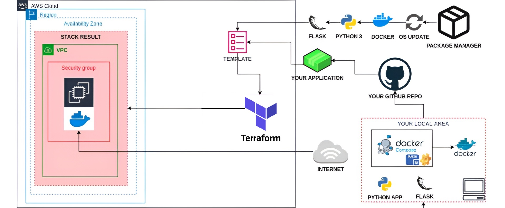

# End-to-End Deployment of Web API using Docker, MySQL, and Terraform on AWS

[](https://www.python.org/)
[](https://flask.palletsprojects.com/)
[](https://www.docker.com/)
[](https://www.terraform.io/)
[](https://www.mysql.com/)

A modern bookstore web service built with Python Flask, containerized using Docker, and deployed on AWS EC2 using Terraform. This project demonstrates best practices in containerization, infrastructure as code, and cloud deployment.

## 🚀 Features

- RESTful API for bookstore management
- Docker containerization
- MySQL database integration
- AWS EC2 deployment with Terraform
- Automated infrastructure provisioning
- Scalable and maintainable architecture

## 🎥 Demo

Check out the [project demonstration video](./project_run.mp4) to see how the application works in action.

## 🏗️ Architecture

Below is the architecture diagram of the project:



## 📋 Prerequisites

- Python 3.x
- Docker and Docker Compose
- Terraform
- AWS CLI configured with appropriate credentials
- Git

## 🛠️ Project Structure

```
.
├── bookstore-api.py      # Flask application
├── requirements.txt      # Python dependencies
├── Dockerfile           # Docker configuration
├── docker-compose.yml   # Docker Compose configuration
├── main.tf             # Terraform configuration
├── bootstrap.sh        # EC2 instance bootstrap script
├── bookstore-frontend.html # Frontend HTML/JS interface
├── project_arch.png    # Architecture diagram
├── project_run.mp4     # Demo video of the project
└── README.md           # Project documentation
```

## 🚀 Getting Started

### Local Development

1. Clone the repository:
   ```bash
   git clone https://github.com/0xnomy/ec2-dockerized-flask-api.git
   cd ec2-dockerized-flask-api
   ```

2. Install dependencies:
   ```bash
   pip install -r requirements.txt
   ```

3. Run with Docker Compose:
   ```bash
   docker-compose up --build
   ```

### AWS Deployment

1. Initialize Terraform:
   ```bash
   terraform init
   ```

2. Review the deployment plan:
   ```bash
   terraform plan
   ```

3. Apply the configuration:
   ```bash
   terraform apply
   ```

## 📚 API Endpoints

| Method | Endpoint | Description |
|--------|----------|-------------|
| GET    | /books   | List all books |
| GET    | /books/{id} | Get book by ID |
| POST   | /books   | Create new book |
| PUT    | /books/{id} | Update book |
| DELETE | /books/{id} | Delete book |

## 🔧 Configuration

### Environment Variables

- `MYSQL_HOST`: MySQL host address
- `MYSQL_USER`: MySQL username
- `MYSQL_PASSWORD`: MySQL password
- `MYSQL_DATABASE`: Database name

### AWS Configuration

- EC2 Instance Type: t2.micro
- AMI: Amazon Linux 2
- Security Group: Open port 80 for HTTP
- Tags: "Web Server of Bookstore"

## 📝 License

This project is licensed under the MIT License - see the LICENSE file for details.

## 🤝 Contributing

1. Fork the repository
2. Create your feature branch (`git checkout -b feature/AmazingFeature`)
3. Commit your changes (`git commit -m 'Add some AmazingFeature'`)
4. Push to the branch (`git push origin feature/AmazingFeature`)
5. Open a Pull Request

## 📫 Contact

[@0xnomy](https://twitter.com/0xnomy)

Project Link: [https://github.com/0xnomy/ec2-dockerized-flask-api](https://github.com/0xnomy/ec2-dockerized-flask-api)

